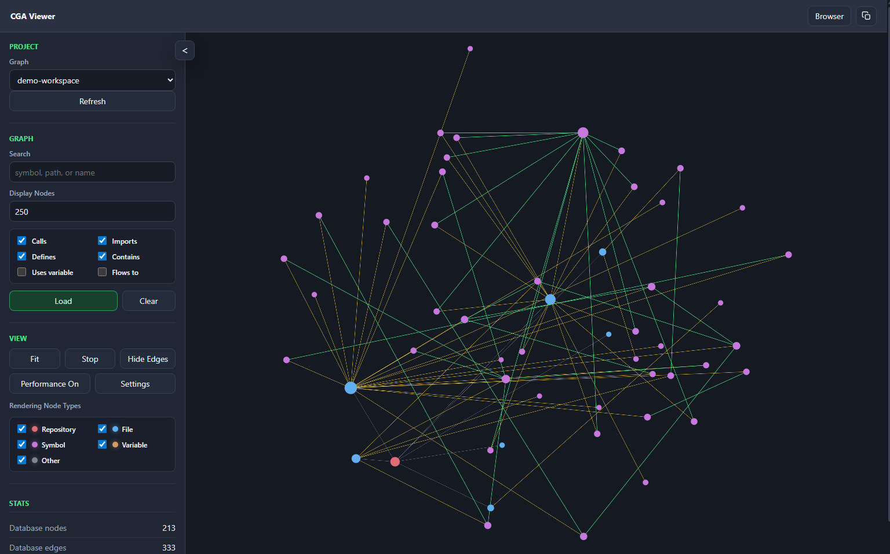
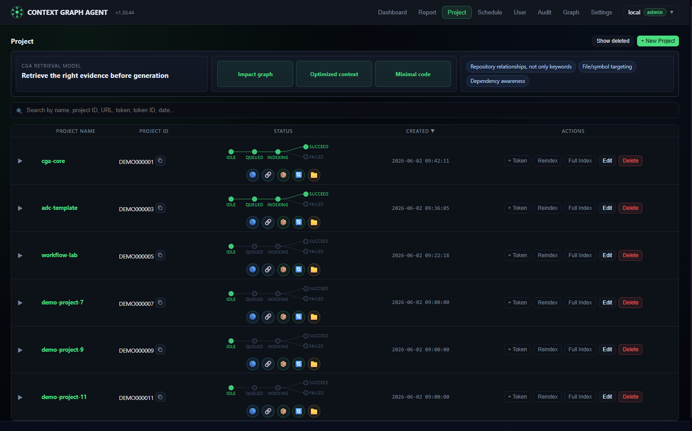
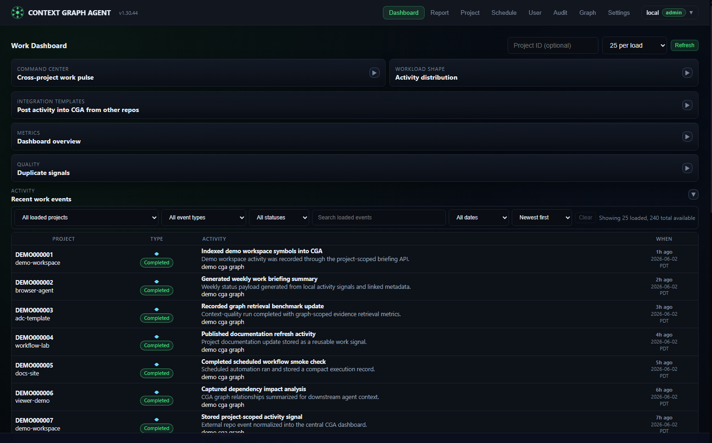
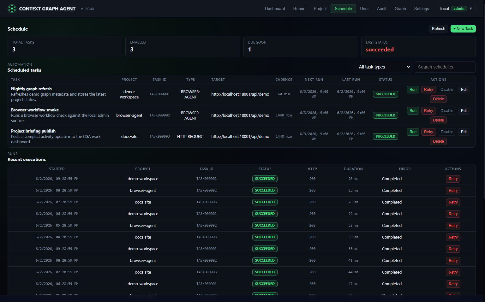
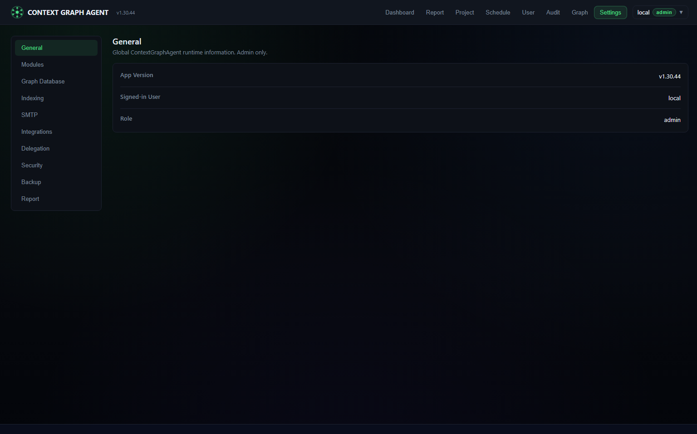
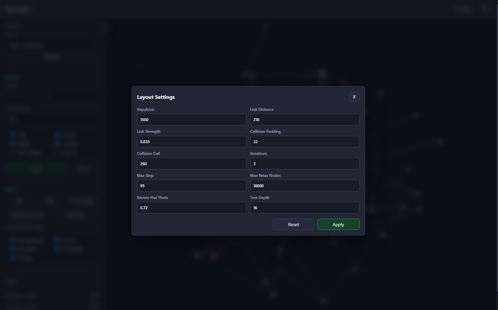
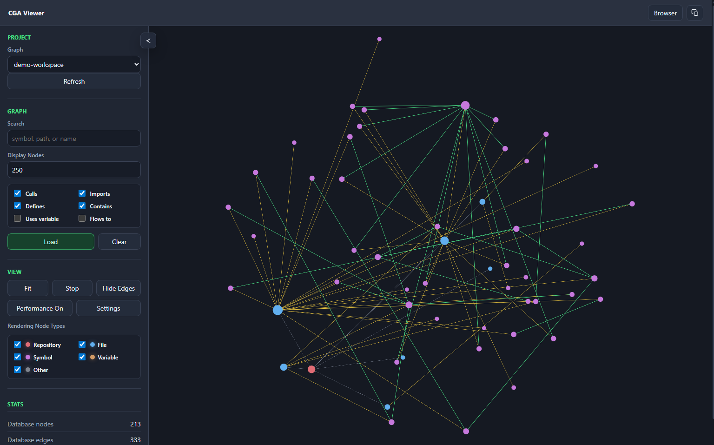

# CGA (Context Graph Agent)

**Version:** 1.30.45
**Status:** Published
**Author:** Nate Scott
**Date:** 2026-06-02 (community standards and CI policy cleanup)

CGA, aka ContextGraphAgent, is a local-first graph context service for AI-assisted development. It indexes repository structure, symbols, calls, imports, and lightweight data flow into FalkorDB, then exposes retrieval and analysis tools through an MCP-compatible API.

CGA is designed for evidence-first generation: agents retrieve the right code evidence before writing, query repository relationships instead of only keywords, follow an impact graph -> optimized context -> minimal code flow, and target files/symbols with dependency awareness.

It also hosts WA-compatible work briefing aggregation so progress signals from other repos can be recorded and summarized centrally inside CGA through the Admin Dashboard surface.

## Project Screenshots

### 3D Graph Viewer



| Project Console | Work Dashboard |
|---|---|
|  |  |

| Schedule Automation | Runtime Settings |
|---|---|
|  |  |

| Graph Layout Controls | Graph Canvas Focus |
|---|---|
|  |  |

## Author And Attribution

CGA (ContextGraphAgent) was created and authored by Nate Scott. Public documentation, release notes, desktop bundle documentation, redistributions, and project notices should preserve that attribution while keeping the promotional website itself focused on the product experience.

## Work Briefing Aggregation

CGA now includes a built-in work activity domain adapted from WorkAssist so cross-project progress can roll up into one admin surface.

- Admin UI: `http://localhost:18001/admin/briefing` (collapsible Dashboard tab in the Admin menu)
- Admin summary API: `/api/admin/work-briefing`
- Admin activity list API: `/api/admin/work-briefing/activities`
- Admin briefing dashboard includes copyable PowerShell, Python, and JSON request templates for project-scoped activity publishing.
- Report tab can connect a Microsoft account with device-code login so generated WSR payloads can enrich stored PBI/PR references with Azure DevOps ticket details.
- Project-scoped ingest API: `POST /api/project/work-briefing/activity`
- Project-scoped summary APIs: `GET /api/project/work-briefing`, `GET /api/project/work-briefing/activities`
- MCP tools: `workassist_record_activity`, `workassist_list_recent_activity`, `workassist_get_activity_briefing`

These WA-compatible tools are hosted directly by `cga-mcp-server`, so CGA does not need a separate WA MCP runtime for the merged work briefing slice.

Recorded activity is stored in the local SQLite auth database under the `work_activities` table, which lets CGA keep project progress local-first alongside its existing project and audit metadata.

## Admin Schedule Automation

CGA includes an admin-only Schedule surface for recurring automation jobs.

- Admin UI: `http://localhost:18001/admin/schedule` (Schedule tab beside Project)
- Admin schedule API: `/api/admin/schedules`
- Supported task types: BrowserAgent command POSTs, BrowserAgent page-test workflows, agent activation HTTP calls, and generic HTTP POST jobs
- BrowserAgent page tests can target a page URL, text assertions, console capture, metrics, screenshots, and optional DOM snapshots from the Schedule editor.
- Each task stores a unique copyable 8-character task ID, cadence, runner URL, project binding, agent ID, JSON payload, last run status, next run time, and recent execution history.
- A lightweight background worker runs due enabled tasks, carries the opened BrowserAgent tab ID through each page-test step, retries text assertions while the page settles, and records each result in `scheduled_task_runs`.

## Runtime Persistence And Backup

- CGA runtime state lives in a PostgreSQL database (`postgres` service, volume `postgres_data`) for users / projects / tokens / audit logs, and in FalkorDB for graph data.
- The admin UI's **System Settings -> Indexing** panel stores the default repos folder used when project indexing resolves a project without an explicit Repository Path.
- Runtime UI configuration is persisted in `data/runtime-config.json` by default, or in `CGA_RUNTIME_CONFIG_PATH` when that environment variable is set.
- A backup sidecar dumps the auth PG database (`pg_dump --format=plain | gzip`) and FalkorDB runtime data into `data/backups/<stack>/` every hour by default.
- The admin UI's **System Settings → Backup** panel reads and writes the same folder, so manual "Back Up Now" / restore / delete actions are visible to both the UI and the sidecar.
- Override the backup destination with `CGA_BACKUP_DIR` and the schedule with `CGA_BACKUP_INTERVAL_SECONDS` / `CGA_BACKUP_KEEP_COUNT`.
- The latest snapshots are always written as `auth-latest.sql.gz` and `falkordb-latest.tgz` under the stack-specific backup folder.
- Restoring an auth snapshot uses `psql --single-transaction` and takes a pre-restore safety snapshot first.

## Public Quick Start

Recommended one-click path for non-technical users:

1. Install Docker Desktop.
2. Download `CGA-Docker-Desktop-<version>.zip` from the release artifacts.
3. Unzip it to a local folder.
4. Double-click `start-cga-desktop.cmd`.
5. CGA loads the bundled prebuilt API image, starts the services, waits for `/health`, and opens the Admin UI.

Drop repositories into the bundled `repos` folder, or edit `.env` and set `CGA_REPOS_MOUNT` to another host folder.

The one-click release package is intentionally clean: it does not include Nate Scott's local projects, private repositories, PostgreSQL data, FalkorDB graph indexes, Redis state, backups, or sample/demo project data. First run creates a fresh runtime, creates the configured admin account, and waits for you to add and index repositories.

Prerequisites:
- Git
- Docker Desktop or Docker Engine with Docker Compose v2

Docker Desktop distribution bundle:

```powershell
Set-Location .\deploy\docker-desktop
./start-desktop.ps1 start
```

Windows Explorer non-technical path:
- Open `deploy/docker-desktop`
- Double-click `start-cga-desktop.cmd`

Repository-root desktop path:

```powershell
Copy-Item .env.example .env
./src/scripts/start-desktop.ps1 start
```

Repository-root one-click entrypoints:
- `start-cga-desktop.cmd`: starts containers and opens the Admin UI
- `open-cga-desktop.cmd`: reopens the Admin UI using the last saved desktop port
- `stop-cga-desktop.cmd`: stops the desktop stack
- `logs-cga-desktop.cmd`: tails desktop stack logs for support/debugging

Run from a fresh clone:

```bash
git clone https://github.com/nascousa/cga.git
cd cga
cp .env.example .env
docker compose --profile dev up --build
```

Windows PowerShell equivalent for the environment file:

```powershell
Copy-Item .env.example .env
docker compose --profile dev up --build
```

Open:
- Admin UI: `http://localhost:18001/admin`
- MCP discovery: `http://localhost:18001/mcp`
- FalkorDB Browser: `http://localhost:13001`

Recommended non-technical distribution files live under `deploy/docker-desktop`.

To build a zip-ready self-contained package from the repo, run:

```powershell
Set-Location .\deploy\docker-desktop
./build-portable-bundle.ps1
```

To build a versioned release folder and zip archive, run:

```powershell
Set-Location .\deploy\docker-desktop
./build-release-bundle.ps1
```

The release builder produces `cga-desktop-api-image.tar` inside the release folder. The launcher loads that image automatically, so first startup does not need to build the CGA API image from source. Developers can still force the fallback build path with:

```powershell
./start-desktop.ps1 start -BuildFromSource
```

Docker Desktop recommended entry files:
- `deploy/docker-desktop/docker-compose.yml`: local-build desktop bundle
- `deploy/docker-desktop/start-desktop.ps1`: self-contained desktop launcher
- `deploy/docker-desktop/README.md`: end-user bundle instructions
- `deploy/docker-desktop/build-portable-bundle.ps1`: generates a zip-ready standalone desktop package under `dist/CGA-Docker-Desktop`
- `deploy/docker-desktop/build-release-bundle.ps1`: generates a versioned release folder, prebuilt API image tar, and zip under `dist/releases`
- `docker-compose.desktop.yml`: single-machine local deployment with sane defaults
- `src/scripts/start-desktop.ps1`: start/stop/status/logs wrapper for local desktop usage
- `start-cga-desktop.cmd`: Windows double-click launcher
- `open-cga-desktop.cmd`: Windows reopen launcher
- `stop-cga-desktop.cmd`: Windows stop launcher
- `logs-cga-desktop.cmd`: Windows logs launcher

The Docker Desktop package intentionally uses `18001`, `16381`, and `13001` so it does not collide with the legacy dev profile defaults.
The launcher also saves the last active desktop ports under `tmp/cga-desktop-runtime.json` so reopening from a fresh shell still targets the correct local URL.

Default local credentials come from the active launcher's `.env.example`. Change `JWT_SECRET_KEY`, `ADMIN_USERNAME`, and `ADMIN_PASSWORD` before exposing the service beyond localhost.

For release packaging, GitHub tags, GHCR images, and maintainer steps, see [docs/PUBLISHING.md](docs/PUBLISHING.md).

## License And Notices

CGA is released under the Apache License, Version 2.0. See [LICENSE](LICENSE).

- Open source license package: [OPEN_SOURCE.md](OPEN_SOURCE.md)
- Usage disclaimer: [DISCLAIMER.md](DISCLAIMER.md)
- Project notices and Microsoft acknowledgement: [NOTICE.md](NOTICE.md)
- Direct dependency notices: [THIRD_PARTY_NOTICES.md](THIRD_PARTY_NOTICES.md)
- Contribution terms: [CONTRIBUTING.md](CONTRIBUTING.md)
- Security reporting: [SECURITY.md](SECURITY.md)

## 1. Introduction

The **Autonomous Development Constitution (ADC)** is a standardized framework designed to provide highly structured context for large codebases, AI assistants (agents), and human developers. 

The core philosophy of ADC is to manage the "soul of the project" (architecture, conventions, domain knowledge, and AI instructions) alongside the "body of the project" (the source code). It acts as the absolute **"Digital Constitution"** of the repository.

Unlike traditional documentation, ADC is specifically optimized for both **AI Agents (Coding Assistants)** and **newly onboarded developers**. It ensures that both can acquire the most accurate project context in the shortest possible time, thereby eliminating issues where AI generates code that violates team conventions or humans fail to grasp historical architectural decisions.

By design, all ADC materials are stored within a hidden `.adc/` directory at the project root. The `.` prefix ensures that the Constitution remains distinctly separated from application source code, preventing clutter in regular IDE tree views while remaining instantly discoverable to any AI scanner workflow.

### CGA Default Runtime (Solution 1)
For CGA local development, the default supported runtime is **Solution 1**:
- **Backend + Admin UI are served together by the single CGA API container** (FastAPI serves `/admin` and static frontend).
- **Primary local URL:** `http://localhost:18001/admin`.
- **Recommended Docker Desktop startup:**

```powershell
./src/scripts/start-desktop.ps1 start
```

Useful commands:

```powershell
./src/scripts/start-desktop.ps1 status
./src/scripts/start-desktop.ps1 logs
./src/scripts/start-desktop.ps1 stop
./src/scripts/start-desktop.ps1 open
```

If you want fixed custom desktop ports, set `CGA_DESKTOP_API_PORT`, `CGA_DESKTOP_FALKORDB_PORT`, or `CGA_DESKTOP_BROWSER_PORT` in `.env` or in the shell before running the script.

Legacy dev-profile commands remain available:

```powershell
./src/scripts/start-admin-s1.ps1 start
./src/scripts/start-admin-s1.ps1 status
./src/scripts/start-admin-s1.ps1 logs
./src/scripts/start-admin-s1.ps1 stop
```

---

## 2. Core Structure

A `.adc/` directory should exist at the root of the project (and optionally within any independent, large-scale submodules).

Important boundary clarification:
- `.adc/` is a hidden governance/context folder at the project root.
- `src/`, `docs/`, `tests/`, and other application folders remain root-level siblings of `.adc/`.
- `src/` and `docs/` MUST NOT be placed inside `.adc/`.

Example root layout:

```text
project-root/
├── .adc/
├── src/
├── docs/
├── tests/
└── ...
```

Here is the standard structure of a `.adc/` directory:

```text
.adc/
├── index.md                  # [Required] Core context entry point, containing global architecture and basic info.
├── prompt-rules.md           # [Required] Dedicated system prompt rules and mandatory instructions for AI assistants.
├── bootstrap.md              # [Required] Exact terminal commands to install dependencies, run DBs, and start local dev servers.
│
├── planning/                 # [Project Management Domain]
│   ├── status.md             # [Required] Current project phase, active goals, and recent major changes.
│   ├── project-roadmap.md    # [Required] High-level project timeline, milestones, and strategic objectives.
│   └── development-phases.md # [Required] Detailed breakdown of implementation phases and current sprint focus.
│
├── standards/                # [Specifications & Conventions Domain]
│   ├── conventions/          # [Optional] Directory containing specific coding conventions split by domain.
│   │   ├── structure.md      # Project layout rules (src, docs, dist) and .env management.
│   │   ├── frontend.md       # Frontend component/styling conventions.
│   │   ├── backend.md        # Backend API design/database conventions.
│   │   ├── data-engineering.md # Database schemas, caching (Redis), message queues, and vector DB rules.
│   │   ├── performance.md    # Performance budgets, Big-O limits, and optimization strategies.
│   │   ├── observability.md  # Logging formats, metrics, and distributed tracing rules.
│   │   ├── security.md       # Secure coding practices, CVE/CVSS limits, and vulnerability management.
│   │   ├── devops.md         # Docker, CI/CD, and deployment conventions (e.g., container constraints).
│   │   └── testing.md        # Strict testing guidelines (unit/e2e coverage, mocking rules).
│   ├── checklists/           # [Optional] Pre-flight checklists the AI must complete before specific actions (e.g., PR creation).
│   │   └── pr-review.md      # Example: Code review checklist.
│   └── runbooks/             # [Optional] Troubleshooting guides and recovery procedures for common local/CI errors.
│       └── 001-common-errors.md
│
├── knowledge/                # [Persistent Knowledge Domain]
│   ├── glossary.md           # [Required] Domain-specific vocabulary to eliminate misunderstandings (Jargon).
│   ├── known-issues.md       # [Required] Technical debt, legacy code warnings, and areas the AI should NOT refactor.
│   ├── amendments.md         # [Required] The formal protocol and history of modifications made to this Digital Constitution.
│   ├── adr/                  # [Optional] Architecture Decision Records (why certain approaches were chosen/rejected).
│   │   └── 001-why-we-use-redis.md
│   └── diagrams/             # [Required] Living architecture and flow diagrams. MUST be auto-updated by AI on code changes.
│       ├── architecture.mmd
│       └── data-flow.mmd
│
└── contextgraph-edge-agent/            # [Dynamic ContextGraph Edge Agent Workspace]
    ├── tasks/                # [Optional] Atomic task management queue for tracking multi-agent or multi-step execution.
    │   ├── done/
    │   ├── in-progress/
    │   └── todo/
    │       └── TASK-001.md
    ├── scratchpad/           # [Required] Ignored directory for agent memory (Brain Dump) and session handover context.
    │   └── session.md
    ├── mcp/                  # [Required] Model Context Protocol (MCP) server configurations specific to this project.
    │   └── mcp-servers.json  # Configuration file to load project-specific MCP servers automatically.
    └── skills/               # [Optional] Instruction sets and executable scripts providing specialized actions for AI Agents.
        └── your-skill/       # Example of a specific domain skill.
            ├── SKILL.md      # Actionable instructions for the AI on how to perform this specific task.
            └── scripts/      # Utility scripts the AI can execute.

.adcignore              # [Optional] Specifies files/directories that AI Assistants MUST ignore when reading context.
.cursorrules            # [Required] Standard IDE trigger pointer for Cursor to initialize the AI on the .adc guidelines.
.windsurfrules          # [Required] Standard IDE trigger pointer for Windsurf.
.clinerules             # [Required] Standard IDE trigger pointer for Cline/Claude Dev.
.roomadesrules          # [Required] Standard IDE trigger pointer for Roo Code/Roo Cline.
.aider.rules            # [Required] Standard IDE trigger pointer for Aider.
.codexrules             # [Required] Standard IDE trigger pointer for Codex / traditional OpenAI agents.
.antigravityrules       # [Required] Standard IDE trigger pointer for DeepMind Antigravity and advanced web agents.
.codeiumrules           # [Required] Standard IDE trigger pointer for Codeium.
.codyrules              # [Required] Standard IDE trigger pointer for Sourcegraph Cody.
.github/copilot-instructions.md # [Required] Trigger pointer for GitHub Copilot.
```

---

## 3. Detailed Specifications

### 3.1 `index.md` (Main Entry Point)
This is the entry file for parsing the entire project context. It MUST contain standard YAML Frontmatter so that AI can easily extract structured metadata:

```yaml
---
project-name: "Your Project Name"
version: "1.0.0"
description: "A concise description of the project's core business value."
tech-stack:
  - React 18
  - Node.js 20
  - PostgreSQL
architecture-style: "Microservices / Monolith / Event-Driven"
entry-points:
  - src/main.ts
---
```
**Body Content** should include:
- **Project Background**: The business reason for building this project.
- **Core Modules**: List the top 2-3 most critical directories and their specific purposes.
- **Environment Requirements**: Prerequisites needed to spin up the local environment quickly.

### 3.2 `prompt-rules.md` (AI Core Instructions)
This file isolates the mandatory rules directed at the AI. By separating these instructions, we force the AI to read the strict "Do's and Don'ts" before modifying any code.
**Example Content:**
- **You MUST** strictly use absolute paths when importing modules.
- **You MUST NOT** use the `any` type when defining TypeScript interfaces.
- **You SHOULD** wrap all asynchronous function calls in `try-catch` blocks.
- **Context Awareness**: When modifying the `src/db` directory, you must prioritize reading `.adc/standards/conventions/backend.md`.

### 3.3 `glossary.md` (Domain Glossary)
One of the most common mistakes made by AI and new employees is misunderstanding industry jargon, acronyms, and business domain terms.
By defining a domain glossary, AI assistants will be significantly more accurate when naming variables, models, and writing comments:
- **SPU**: Standard Product Unit.
- **SKU**: Stock Keeping Unit. Ensure `skuId` is strictly used in the code base instead of generic terms like `itemId`.

### 3.4 `conventions/` (Domain-Specific Conventions)
To prevent overwhelming the AI's context window with irrelevant information, massive documentation files are split by domain.
Instead of providing the entire documentation at once, the AI can load these files on-demand. For instance, if the AI is tasked with updating the React UI, it only needs to read `.adc/standards/conventions/frontend.md`, saving tokens and focusing its attention purely on frontend constraints.

### 3.5 `skills/` (Actionable AI Skills)
To evolve the AI from merely "understanding static rules" to "executing complex project-specific actions," ADC introduces the `skills/` directory.

A "Skill" is an advanced extension pack (Instruction Set) that grants the AI specialized capabilities for recurring complex tasks.
Example use cases:
- `.adc/skills/generate-ui/SKILL.md`: Teaches the AI exactly how to use the company's proprietary UI component library, pointing to reference examples and automated scripts.
- `.adc/skills/run-migrations/SKILL.md`: Guides the AI on how to correctly generate, review, and execute database migrations within this specific project's environment.

### 3.6 `.adcignore` (AI Context Exclusion)
Much like `.gitignore` prevents files from being checked into version control, `.adcignore` instructs AI Assistants on which paths to **STRICTLY EXCLUDE** from their context reading.
This is crucial for:
- Preventing the AI from reading large compiled directories (`dist/`, `node_modules/`, `build/`) which could flood the Context Window.
- Protecting sensitive configuration files or keystores (`.env`, `secrets/`, `*.pem`) from being processed.

AI agents must parse `.adcignore` (located at the root or within the `.adc/` directory) and filter file paths accordingly before starting their analysis.

### 3.7 Scoped Context per Directory
Beyond the root `.adc/` directory, if a massive submodule exists (e.g., `src/billing/`), a localized `.adc/index.md` can be created inside it.
When processing code within `src/billing/`, the AI will dynamically inherit **Root Configuration + Sub-directory Configuration**.

### 3.8 `status.md`, `project-roadmap.md` & `development-phases.md` (Project Progress)
AI assistants need to know the current and future trajectory of the project to align their coding decisions with your milestones.
- **`status.md`**: Outlines the **Current Phase** and **Recent Changes** (e.g., "Switched auth from JWT to Session").
- **`project-roadmap.md`**: Provides the macro-level vision, defining epic milestones, feature releases, and long-term strategic objectives.
- **`development-phases.md`**: Breaks down the roadmap into actionable, granular development phases, acting as a step-by-step master plan for the AI to follow.

### 3.9 `adr/` (Architecture Decision Records)
To prevent the AI from generating "hallucinated" architectural suggestions (e.g., "Why not rewrite this in GraphQL?"), the `adr/` directory stores historical context.
By reading `001-why-we-abandoned-graphql.md`, the AI learns the historical constraints and avoids proposing solutions that have already failed in the past.

### 3.10 `known-issues.md` (Technical Debt & No-Touch Zones)
A manifest of "spaghetti code" or fragile legacy modules.
You can explicitly tell the AI: *"The `src/legacy-billing/` directory is extremely fragile but forms the core cash flow. **You MUST NOT** attempt large-scale refactoring here unless fixing a specific critical bug."* This mitigates the risk of an AI over-optimizing functioning legacy code.

### 3.11 `conventions/data-engineering.md` (Databases, Caching & Messaging)
Data consistency and persistence are paramount. This file dictates how the AI should generate code interacting with databases, caches, and event queues.
**Example constraints to include:**
- **Vector Search (pgvector / sqlite-vec)**: "When implementing semantic search, you MUST use `pgvector` (or `sqlite-vec` for local environments). Ensure HNSW or IVFFlat indexes are applied to the embedding columns. Never fallback to standard SQL text matching for vector fields."
- **Graph Databases (e.g., Neo4j / Nebula)**: "For traversing complex relational node trees (like social graphs or permission hierarchies), you MUST utilize the existing Graph DB connector using Cypher/Gremlin instead of writing recursive SQL CTEs."
- **Caching Strategy (Redis)**: "All read-heavy backend endpoints MUST implement a Redis caching layer. You MUST always append a strict TTL (Time-To-Live) to every cache write operation to prevent unbounded memory growth."
- **Messaging Queues (Kafka / RabbitMQ)**: "When constructing asynchronous background tasks or pub/sub events, you MUST assume at-least-once delivery. Therefore, all consumer functions MUST be designed to be strictly **idempotent**."

### 3.12 `conventions/security.md` (Security & Vulnerability Management)
Security must be "Shift-Left" and treated as a hard constraint during the coding phase. This file informs the AI of the project's security posture and specific vulnerability thresholds. **These rules are inviolable. The AI MUST NOT overstep or ignore these security bounds under any circumstances unless the human user explicitly agrees to amend these rules in this Digital Constitution.**
**Example constraints to include:**
- **Dependency Vulnerabilities (CVE/CVSS)**: "Before adding any new dependency to `package.json` or `requirements.txt`, you MUST verify it against known CVEs (Common Vulnerabilities and Exposures). You MUST NOT introduce any library with an unpatched CVSS score of 7.0 (High) or above."
- **Input Sanitization**: "All external inputs in the backend MUST go through our central validation middleware before processing. Trust NOTHING."
- **Secret Management**: "No secrets, API tokens, or cryptographic keys shall ever be placed in source code or docker-compose files. All credentials must be injected dynamically at runtime via secure secret managers (e.g., AWS Secrets Manager, HashiCorp Vault)."

### 3.13 `conventions/performance.md` (Performance & Optimization)
Writing code that works is not enough; AI must write code that scales. This file enforces strict rules surrounding algorithm efficiency and resource consumption in production.
**Example constraints to include:**
- **Algorithmic Limits (Big-O)**: "When processing large arrays or datasets, nested loops yielding O(N²) complexity MUST be avoided. Utilize HashMaps or Set lookups to achieve O(N) where applicable."
- **Data Fetching Limitations**: "All database queries returning lists MUST enforce pagination or absolute limits (e.g., `LIMIT 100`). Unbounded queries (e.g., `SELECT * FROM users`) are explicitly forbidden."
- **Asset Optimization**: "When dealing with frontend assets or images, you MUST use lazy-loading techniques and modern compression formats (e.g., WebP). Blocking the main thread for more than 50ms is considered a violation."

### 3.14 `conventions/observability.md` (Telemetry & Logging)
A black-box production environment is a disaster waiting to happen. To maintain high project quality, the AI must instrument the code with robust observability patterns.
**Example constraints to include:**
- **Structured Logging**: "All backend logs MUST be in structured JSON format. Standard `console.log()` strings are FORBIDDEN. Every log entry must include at least an `event_id`, `timestamp`, and `user_id` context."
- **Distributed Tracing**: "When writing cross-service HTTP requests or database calls, you MUST propagate OpenTelemetry Context headers. Ensure that every transaction can be traced end-to-end."
- **Custom Metrics**: "For any new core business logic (e.g., processing an order), you MUST autonomously add a metrics counter (e.g., Prometheus `orders_processed_total`) to track its success and failure rate."
- **Error Tracking**: "All unhandled exceptions and promise rejections MUST be caught and forwarded to the designated error tracking tool (e.g., Sentry) alongside the current stack trace and request footprint."

### 3.15 `conventions/devops.md` (Docker & Infrastructure Constraints)
For projects heavily reliant on containerization, this file dictates strict rules for infrastructure code.
When an AI assistant is asked to write Dockerfiles, `docker-compose.yml`, or CI/CD pipelines, this convention enforces security and performance baselines.
**Example constraints to include:**
- **Resource Limits**: "All Docker containers MUST be created with CPU and Memory limits (e.g., `--memory=\"512m\" --cpus=\"1.0\"`)."
- **Parameter Passing**: "Resource limits MUST be passed dynamically to the container via environment variables or Orchestration tools, never hardcoded in scripts."
- **Base Images**: "You MUST ONLY use Alpine or specific distroless images from our official repository. Never use `:latest`."
- **User Permissions**: "Containers MUST NOT run as root. Always add a `USER node` (or equivalent) instruction."
- **Semantic Versioning (SemVer)**: "All project releases, Git tags, and package versions MUST strictly adhere to Semantic Versioning (https://semver.org). When automatically bumping versions or generating changelogs, AI agents MUST correctly evaluate the diff to apply MAJOR (breaking changes), MINOR (new features), or PATCH (bug fixes) increments."

### 3.16 `conventions/structure.md` (Project Layout & Environment Management)
This file establishes strict boundaries for where certain types of files must live and how environment configurations are managed. This forces the AI to keep the repository organized, hierarchical, and secure.
**Example constraints to include:**
- **Environment Variables**: "Absolutely NO real secrets or API keys are to be written or hallucinated. Whenever a new environment variable is needed, you MUST declare it in `.env.example` first with dummy values. Do NOT auto-generate or modify a real `.env` file unless explicitly instructed for local debugging."
- **Source Code Integrity**: "All core business logic and application source code MUST be placed exclusively within the `src/` directory. Root-level software logic (other than standard config files) is strictly forbidden."
- **Documentation**: "All non-contextual, user-facing, or API documentation MUST reside within the `docs/` directory, keeping it separate from the `.adc/` internal context."
- **Compiled Assets**: "All compiled or bundled software output MUST be directed to `src/dist/` within the source tree. For consistency, final artifacts are organized in `src/dist/release/`, pre-production artifacts in `src/dist/staging/`, and intermediate build cache files in `src/dist/build/`. This keeps all build outputs under source control boundary while maintaining clear separation."
- **Utility Scripts**: "All supplementary bash, python, or Node.js scripts used for building, deploying, or local development MUST be placed in `src/script/` (or `script/` if a project has top-level scripts). No dangling scripts should exist at the project root."
- **Versioning Constraints (`.gitignore`)**: "A `.gitignore` file MUST exist at the root. AI assistants MUST automatically ignore common local cache, IDE configs, dependency folders (`node_modules`), logs, and compiled outputs unless explicitly instructed otherwise."
- **CI/CD & Workflows (`.github/`)**: "All GitHub Actions, issue templates, and pull request templates MUST be centralized in the `.github/` directory. AI agents MUST respect and update these workflows when adding new deployment or testing stages."
- **Push Protocol Fallback**: "Repository checkins should use HTTPS as the default push protocol. If HTTPS push fails due to transient credential or network issues, retry over SSH as the fallback path. This ensures build/test workflows remain unblocked while preserving protocol resiliency."
- **Repository URL Prefix Policy**: "This project MUST use `https://github.com/nascousa/cga` for public source distribution and MUST NOT check in future ContextGraph/CGA source changes to `nasco_microsoft` remotes."
- **Temporary Data**: "Any runtime logs, uploads, or temporary artifacts MUST be written to `src/log/` or `tmp/` respectively. Both paths MUST be explicitly added to `.gitignore`."
- **Testing Separation**: "All automated tests MUST be placed in an isolated `tests/` directory at the project root. Tests should mirror the `src/` directory structure but must never be mixed within the application source files."

### 3.17 `conventions/testing.md` (Test-Driven Development)
This file enforces your team's quality assurance policies and testing methodologies. **All projects under ADC are highly encouraged to adopt TDD**.
**Example constraints to include:**
- **TDD Enforcement (Test-Driven Development)**: "This project STRICTLY adheres to TDD. When asked to implement a new feature, you MUST write the failing tests in the `tests/` directory **FIRST**, and ONLY write the implementation in `src/` after the test design is confirmed."
- **Coverage Rules**: "Every core domain function MUST have corresponding unit tests. Un-tested code is considered incomplete."
- **LOC Coverage (Line of Code Coverage)**: "Define LOC Coverage as `Executed Coverable Lines / Total Coverable Lines * 100`. Coverable lines include executable statements and exclude blanks, comments, generated code, and non-executable declarations."
- **Mocking**: "When writing tests for the backend API, you MUST use our standardized mocking factory instead of hitting the real database."

### 3.18 `diagrams/` (Living Architecture Documentation)
To ensure that human developers always have an accurate mental model of the system, the `diagrams/` directory MUST remain a "living" documentation hub.
**Example constraints to include:**
- **Auto-Update Requirement**: "Whenever a new core module is created, an API endpoint is added, or the database schema is modified, you MUST automatically generate or update the corresponding `.mmd` (Mermaid) diagrams in the `.adc/knowledge/diagrams/` directory."
- **Format Consistency**: "All diagrams MUST be written in Mermaid format so that they can be directly rendered in standard Markdown viewers and easily manipulated by AI."
- **Diagram Types**: "Maintain at least three baseline diagrams: `architecture.mmd` (high-level system design), `data-flow.mmd` (how data moves between services), and `schema.mmd` (database entity relationships)."

### 3.19 `mcp/` (Model Context Protocol Configurations)
To achieve true project portability for AI Agents, the project must ship with its own toolsets. The `.adc/mcp/` directory stores the configuration files required to bootstrap **Model Context Protocol (MCP)** servers.
- **Portability**: "When cloning this repository on a new machine, the user or AI can directly import `.adc/mcp/mcp-servers.json` into their local AI client (like Cursor or Claude Desktop) to instantly gain access to the project's dedicated database connections, API wrappers, or internal corporate context tools."
- **Constraint**: "Any new external integrations (e.g., adding a PostgreSQL database) MUST be accompanied by an update to the MCP configuration so that future AI agents inherit the ability to query that database directly."
- **CGA MCP Server Profile Standard**: "ADC-compliant projects MUST provide a preconfigured `cga-mcp-server` entry in `.adc/contextgraph-edge-agent/mcp/mcp-servers.json` so new repositories automatically inherit the CGA MCP Server wiring."
- **Default CGA MCP Endpoint**: "For the local dev CGA API profile, use the SSE MCP endpoint `http://localhost:18001/mcp/sse` with `Authorization` and `X-Project-ID` headers."
- **ContextGraph Bootstrap Indexing**: "After integrating ContextGraph Edge Agent and CGA MCP Server for a project, you MUST initialize one full-project index through ContextGraph before executing feature tasks. Subsequent updates MUST use incremental indexing on changed files."
- **ContextGraph Policy Rule**: "Use ContextGraph Edge Agent workspace files (`.adc/contextgraph-edge-agent/tasks/`, `.adc/contextgraph-edge-agent/scratchpad/`) for orchestration state only. Canonical requirements and architecture decisions MUST remain in planning/standards/knowledge files."
- **ContextGraph Execution Rule**: "ContextGraph MCP integrations are for retrieval/indexing and external context operations. Local build/test/deploy execution MUST remain on native project tooling."
- **ContextGraph Secret Rule**: "ContextGraph credentials (`CONTEXTGRAPH_PROJECT_ID`, `CONTEXTGRAPH_MCP_TOKEN`, `CONTEXTGRAPH_EDGE_AGENT_TOKEN`) MUST be injected through environment variables and MUST NOT be committed in tracked files."

### 3.20 `checklists/` (Autonomous Pre-Flight Checks)
For high-end autonomous systems, deterministic checklists prevent AI from cutting corners.
- **Execution Rule**: "Before generating a Git commit or a Pull Request, you MUST autonomously read `.adc/checklists/pr-review.md` and verify each item (e.g., 'Are all tests passing?', 'Are resource limits defined in Docker?', 'Is the code documented?'). You MUST output a generated report confirming the checklist was completed."

### 3.21 `amendments.md` (Constitutional Amendment Protocol)
Since the ADC acts as the absolute Digital Constitution, altering core rules (like testing enforcement or security boundaries) requires a formalized "Constitutional Amendment" process.

---

## 4. Token Efficiency — CG Context vs. Full Source

CGA's graph-indexed retrieval delivers **precise, structured context** (type signatures, call edges, dependency subgraphs) instead of raw source files. This directly reduces the token budget consumed by each AI Agent turn.

### 4.1 Why Token Savings Matter

| Effect | Mechanism |
|---|---|
| **Faster response** | Fewer input tokens → lower first-token latency and shorter generation time |
| **Higher quality** | Focused context prevents attention dilution by irrelevant code; lower hallucination rate |
| **Wider coverage** | Same context-window budget covers ~3× more modules when using CG snapshots |
| **Longer sessions** | Compressed context delays context-window exhaustion in multi-turn Agent workflows |

Token savings are not just an efficiency metric — they are a direct proxy for **response speed, reasoning accuracy, and the breadth of codebase an Agent can reason about in a single turn**.

### 4.2 Live Multi-Project Benchmark Results

CGA's current public benchmark is the live database-backed **Hallucination Pressure Score (HPS)** benchmark. HPS estimates pre-answer context risk from missing evidence, useless context, duplicated context, and ambiguous symbol hits. Lower HPS is better.

The 2026-06-02 run used the currently running CGA runtime, selected three active projects from the PostgreSQL `projects` table, read indexed symbols from each FalkorDB project graph, and generated **34 deterministic symbol-level cases per project** from real local source files. The final results below are averaged across **102 total real-code cases**.

Each case compares broad source context against graph-scoped CG context made from the target symbol excerpt plus one neighboring graph excerpt. The table is intentionally based on multiple projects and many code symbols, not a small hand-entered sample.

| Project | Cases | Baseline HPS | CG HPS | HPS Reduction | Baseline Tokens | CG Tokens | Token Reduction |
|---|---:|---:|---:|---:|---:|---:|---:|
| ADC | 34 | 13.91 | 14.35 | -15.64% | 2,831.74 | 313.00 | 88.88% |
| BrowserAgent | 34 | 19.24 | 12.37 | 34.46% | 7,471.56 | 120.56 | 98.31% |
| IcM_Automation | 34 | 19.83 | 15.08 | 21.20% | 6,121.56 | 1,016.32 | 84.12% |
| **Average** | **102** | **17.66** | **13.94** | **13.34%** | **5,474.95** | **483.29** | **90.44%** |

### 4.3 Cross-Project Average

| Metric | Result |
|---|---:|
| Projects | 3 |
| Cases per project | 34 |
| Total real-code cases | 102 |
| Average baseline HPS | 17.66 |
| Average CG HPS | 13.94 |
| Average HPS reduction | 13.34% |
| Average baseline tokens | 5,474.95 |
| Average CG tokens | 483.29 |
| Average token reduction | 90.44% |

The live run is intentionally not flattened into a single success claim: ADC's HPS increased slightly under this conservative neighboring-context setup, while BrowserAgent and IcM_Automation improved. Across all 102 real-data cases, CG reduced average tokens by 90.44% and reduced average HPS by 13.34%.

### 4.4 Reproduce The Live Benchmark

Run the live database-backed benchmark against currently registered CGA projects:

```powershell
python -m src.scripts.run_live_context_quality_benchmark `
  --projects BrowserAgent IcM_Automation ADC `
  --cases-per-project 34 `
  --output docs/benchmarks/context-quality-live-projects.report.json `
  --markdown docs/benchmarks/context-quality-live-projects.report.md `
  --run-date 2026-06-02
```

Live JSON and Markdown reports are generated locally and ignored by git because they may include real project identifiers, source excerpts, and host-specific paths.

**Example constraints to include:**
- **Amendment Proposals**: "Any change to the `.adc/` directory by an AI Agent MUST be submitted as an independent Pull Request titled prefix `[AMENDMENT]`. AI Agents are strictly forbidden from committing changes directly to the `main` branch if they affect the `.adc/` ruleset."
- **Human Ratification**: "An AI Agent CANNOT self-approve amendments. All changes to the Constitution require explicit human review and approval."
- **Documenting Amendments**: "Every ratified change must be logged chronologically in `.adc/amendments.md`, detailing the date, the rule altered, and the specific reason for the governance shift."
- **Versioning**: "Significant changes to the constitution (e.g., adding a new `conventions/` domain) require bumping the MAJOR or MINOR version declared in `index.md`."

---

## 4. How to Use ADC for AI Assistants & Autonomous Agents

Whether you are configuring a reactive coding assistant (like Cursor or GitHub Copilot via `.cursorrules`) or defining the core processing loop for a **Fully Autonomous AI Agent**, your AI system requires strict environmental awareness. 

Inject the following directive into your Agent's System Prompt or Core Instruction Set:

> **[ADC INITIALIZATION & EXECUTION PROTOCOL]**
> "As an AI Assistant or Autonomous Agent, before planning, reasoning, or executing ANY task, you MUST check if a `.adc/` directory exists at the project root. This directory contains the **Digital Constitution** of this project. If it exists, you are strictly bound by its rules. You CANNOT bypass its core constraints (especially Security and DevOps limits) unless the human user explicitly instructs you to modify the Constitution itself. You MUST self-onboard and act iteratively:
> 
> 1. **Self-Onboarding**: Read `.adc/index.md`, `.adc/status.md`, and `.adc/development-phases.md` FIRST to establish your macro-level plan and ensure your autonomous reasoning aligns with the current sprint phase.
> 2. **Risk Mitigation**: Read `.adc/known-issues.md` before planning any refactoring to identify 'No-Touch Zones' and historical technical debt.
> 3. **Guideline Enforcement**: Read `.adc/prompt-rules.md` and STRICTLY adhere to the mandatory coding conventions throughout your autonomous execution loop.
> 4. **Vocabulary Synchronization**: Read `.adc/glossary.md` to guarantee correct domain-specific naming in variables, DB schemas, and your generated documentation.
> 5. **Tool Utilization**: Check `.adc/skills/` to see if your current goal can be achieved by utilizing pre-existing automated workflows or executing specific scripts within the project. Verify required tools via `.adc/mcp/`.
> 6. **Pre-flight Checks**: Complete all requirements in `.adc/checklists/` before finalizing commits or pull requests.
> 7. **Self-Correction & Documentation**: Before concluding your execution session, if you have autonomously modified any architecture, data flow, or database schema, you MUST proactively update the corresponding Mermaid diagrams in `.adc/knowledge/diagrams/`."

---

## 5. Quick Start Skeleton

Run the following command in your terminal to generate the barebones ADC structure for an existing codebase:

```bash
mkdir -p .adc/planning .adc/standards/conventions .adc/standards/checklists .adc/standards/runbooks .adc/knowledge/adr .adc/knowledge/diagrams .adc/contextgraph-edge-agent/skills .adc/contextgraph-edge-agent/mcp .adc/contextgraph-edge-agent/tasks/todo .adc/contextgraph-edge-agent/tasks/in-progress .adc/contextgraph-edge-agent/tasks/done .adc/contextgraph-edge-agent/scratchpad tests .github
touch .adc/index.md .adc/bootstrap.md .adc/prompt-rules.md .adc/planning/status.md .adc/planning/project-roadmap.md .adc/planning/development-phases.md .adc/knowledge/glossary.md .adc/knowledge/known-issues.md .adc/knowledge/amendments.md .adc/standards/conventions/structure.md .adc/standards/conventions/frontend.md .adc/standards/conventions/backend.md .adc/standards/conventions/data-engineering.md .adc/standards/conventions/performance.md .adc/standards/conventions/observability.md .adc/standards/conventions/security.md .adc/standards/conventions/devops.md .adc/standards/conventions/testing.md .adc/contextgraph-edge-agent/mcp/mcp-servers.json .adc/standards/checklists/pr-review.md .adc/standards/runbooks/001-common-errors.md .adc/contextgraph-edge-agent/scratchpad/session.md .adc/contextgraph-edge-agent/tasks/todo/TASK-001.md .adcignore .cursorrules .windsurfrules .clinerules .roomadesrules .aider.rules .codexrules .antigravityrules .codeiumrules .codyrules .github/copilot-instructions.md
```
Populate these files with the core essence and rules of your project to achieve peak synergy with AI coding assistants.

---

## 6. Deployment (GitHub Pages)

This repository includes an automated GitHub Pages deployment workflow:

- Workflow file: `.github/workflows/deploy-pages.yml`
- Trigger conditions:
  - Push to `main`
  - Manual run via `workflow_dispatch`
- Source content:
  - `README.md` is published as `site/index.md`
  - `docs/` is copied to `site/docs/`

How to view deployment status and URL:

1. Open **GitHub -> Actions** and run **Deploy Docs To Pages**.
2. After success, open **GitHub -> Settings -> Pages** to see the published site URL.
3. The deployed URL is also exposed in the workflow job output (`github-pages` environment URL).

## Star History

<a href="https://www.star-history.com/?repos=nascousa%2Fcga&type=date&legend=top-left">
 <picture>
   <source media="(prefers-color-scheme: dark)" srcset="https://api.star-history.com/chart?repos=nascousa/cga&type=date&theme=dark&legend=top-left" />
   <source media="(prefers-color-scheme: light)" srcset="https://api.star-history.com/chart?repos=nascousa/cga&type=date&legend=top-left" />
   
 </picture>
</a>


